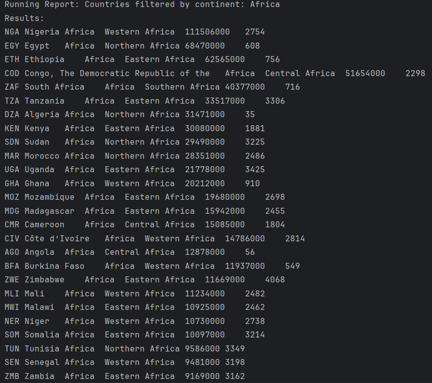
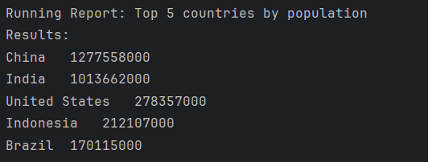

# Devops-G34
Public Repository for Group 3

# DevOps
# Software Engineering Methods

# Project Name

## Requirements Met

Out of 32 total requirements, **X** have been implemented, which is **Y%**.

Below is a detailed breakdown of each requirement, whether it has been met, and evidence in the form of screenshots.

| ID  | Name                                                                                              | Met | Screenshot               |
|-----|---------------------------------------------------------------------------------------------------|-----|--------------------------|
| 1   | All the countries in the world organised by largest population to smallest.                       | Yes |  |
| 2   | All the countries in a continent organised by largest population to smallest.                     | Yes |  |
| 3   | All the countries in a region organised by largest population to smallest.                        | yes |  |
| 4   | The top N populated countries in the world where N is provided by the user.                       | Yes |  |
| 5   | The top N populated countries in a continent where N is provided by the user.                     | yes |  |
| 6   | The top N populated countries in a region where N is provided by the user.                        | Yes |  |
| 7   | All the cities in the world organised by largest population to smallest.                          | Yes |  |
| 8   | All the cities in a continent organised by largest population to smallest.                        | yes |  |
| 9   | All the cities in a region organised by largest population to smallest.                           | Yes |  |
| 10  | All the cities in a country organised by largest population to smallest.                          | Yes |  |
| 11  | All the cities in a district organised by largest population to smallest.                         | yes |  |
| 12  | The top N populated cities in the world where N is provided by the user.                          | Yes |  |
| 13  | The top N populated cities in a continent where N is provided by the user.                        | yes |  |
| 14  | The top N populated cities in a region where N is provided by the user.                           | Yes |  |
| 15  | The top N populated cities in a country where N is provided by the user.                          | Yes |  |
| 16  | The top N populated cities in a district where N is provided by the user.                         | yes |  |
| 17  | All the capital cities in the world organised by largest population to smallest.                  | Yes |  |
| 18  | All the capital cities in a continent organised by largest population to smallest.                | Yes |  |
| 19  | All the capital cities in a region organised by largest population to smallest.                   | yes |  |
| 20  | The top N populated capital cities in the world where N is provided by the user.                  | Yes |  |
| 21  | The top N populated capital cities in a continent where N is provided by the user.                | yes |  |
| 22  | The top N populated capital cities in a region where N is provided by the user.                   | Yes |  |
| 23  | The population of people, people living in cities, and people not living in cities in each continent. | yes |  |
| 24  | The population of people, people living in cities, and people not living in cities in each region. | yes |  |
| 25  | The population of people, people living in cities, and people not living in cities in each country. | Yes |  |
| 26  | The population of the world.                                                                      | Yes |  |
| 27  | The population of a continent.                                                                    | Yes |  |
| 28  | The population of a region.                                                                       | yes |  |
| 29  | The population of a country.                                                                      | Yes |  |
| 30  | The population of a district.                                                                     | yes |  |
| 31  | The population of a city.                                                                         | Yes |  |
| 32  | Number of people who speak Chinese, English, Hindi, Spanish, Arabic.                              | Yes |  |
